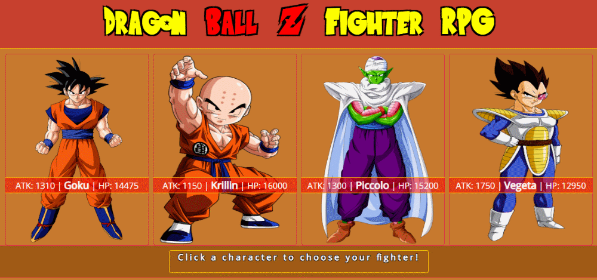
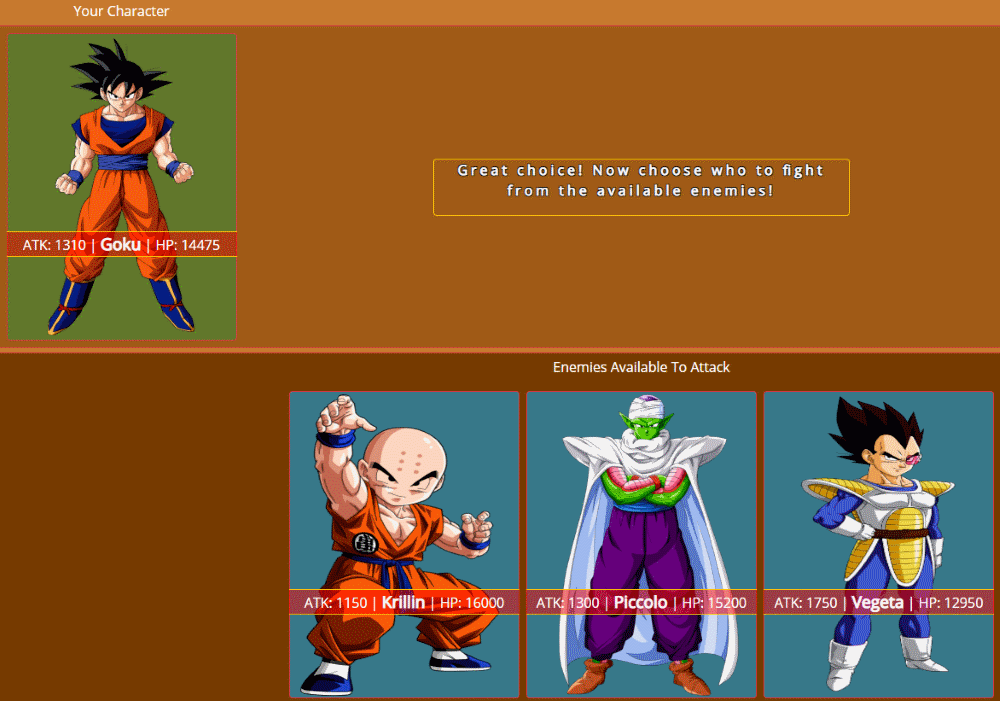
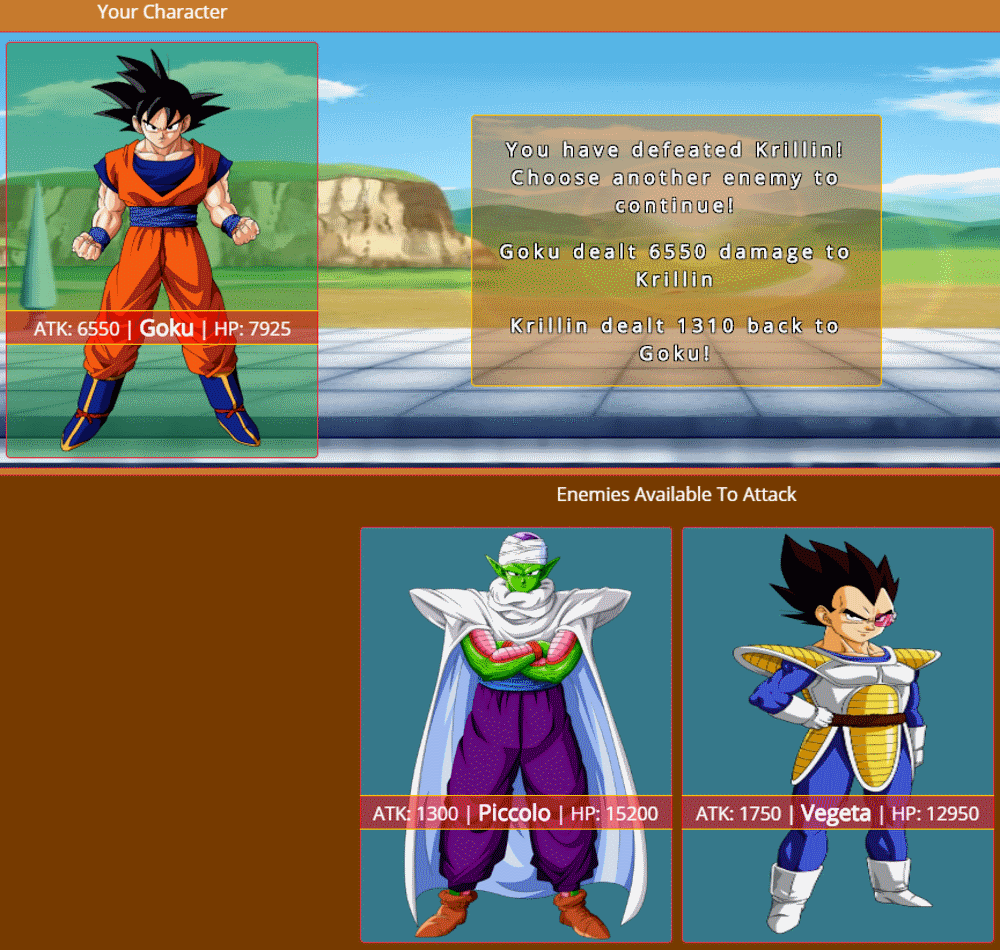
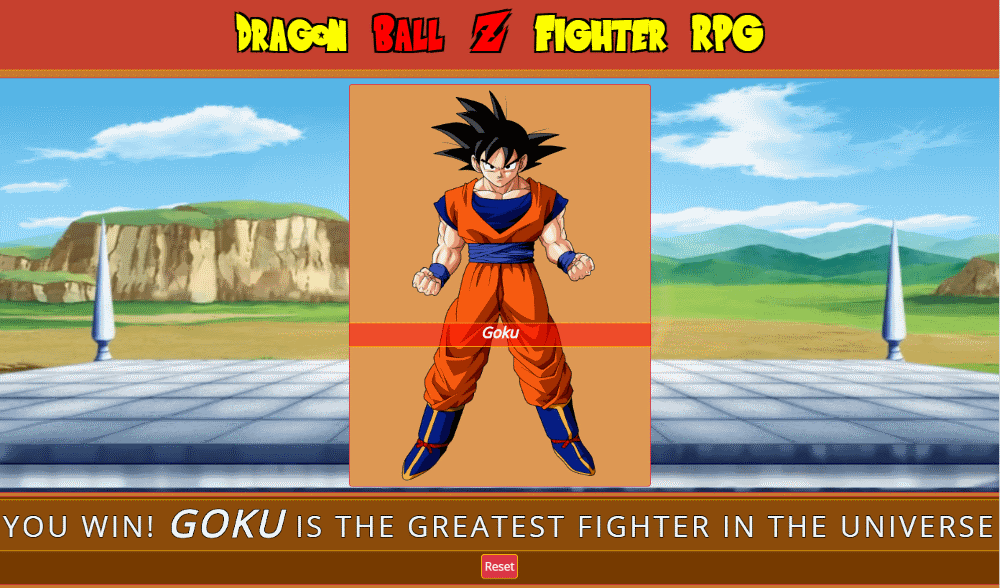
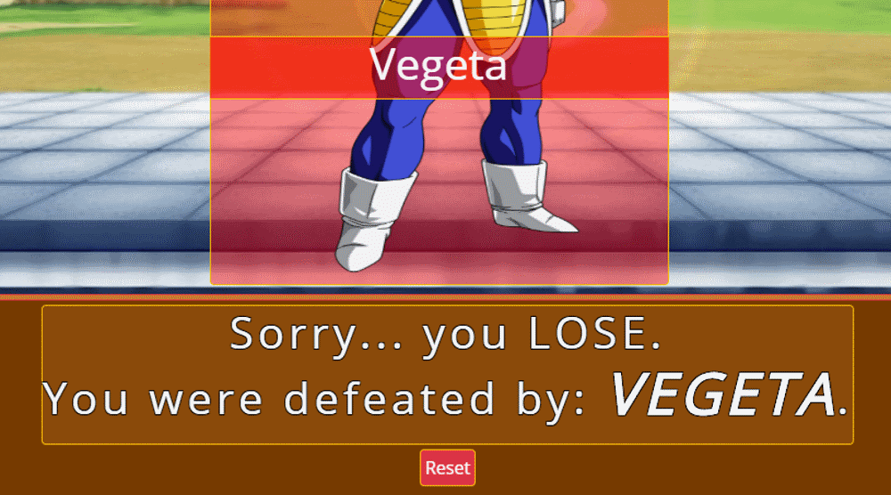

# unit-4-game - Dragon Ball Z RPG Fighting Game

[Click here to play the game.](https://tblukens.github.io/unit-4-game/)

## Getting Started

### To get started simply click the character you would like to be:

### Then select the first enemy you would like to fight from the enemies available to attack section:

### Once that enemy has been defeated you may select another to fight:

### Keep this process up until you win...

### or you lose......

